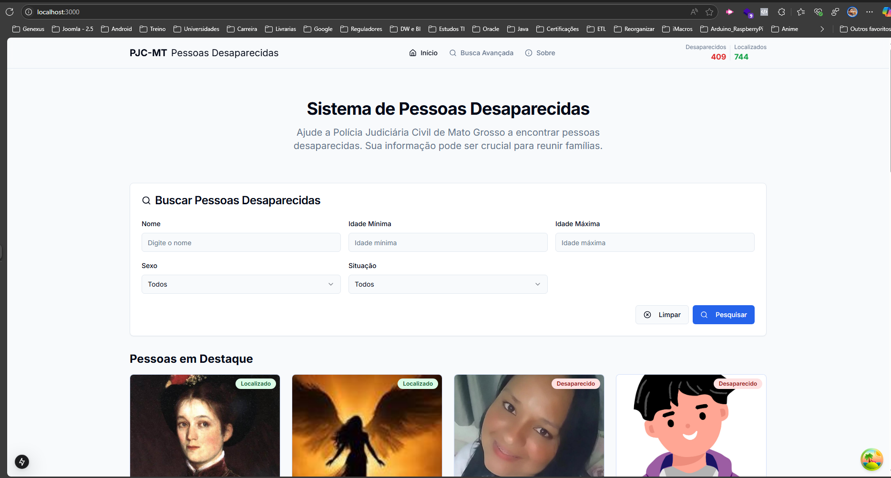

# Dados da Inscrição PSS 02/2025/SEPLAG (Analista de TI - Perfil Junior, Pleno e Sênior)

## Processo Seletivo

**Nome:** Diego Donizete Correa da Silva  
**CPF:** 023.127.121-21  
**Perfil:** DESENVOLVEDOR FRONT-END - SÊNIOR  

---

## Tecnologias Utilizadas

- **Next.js**: Framework React que oferece renderização híbrida (SSR e SSG), ótimo para performance e SEO.
- **React.js**: Biblioteca principal da interface.
- **TypeScript**: Tipagem estática para maior segurança e previsibilidade.
- **Tailwind CSS**: Framework utilitário para estilização rápida e responsiva.
- **ESLint / Prettier**: Padronização e qualidade de código.
- **Axios**: Cliente HTTP para requisições à API.
- **Zustand**: Gerenciador de estado leve, moderno e reativo.
- **Docker / Docker Compose**: Para facilitar o setup e execução da aplicação.

---

## Instruções para rodar o projeto via Docker

### Pré-requisitos
- [Docker](https://www.docker.com/) instalado
- [Docker Compose](https://docs.docker.com/compose/install/) instalado

### Rodando o projeto

```bash
# Clonar o repositório
git clone https://github.com/diekof/processo-seletivo-front-end-senior.git
cd processo-seletivo-front-end-senior

# Subir a aplicação com Docker Compose
docker-compose up


```
---

## Organização do Projeto
A estrutura do projeto foi pensada para facilitar a escalabilidade, separação de responsabilidades e reutilização de código:

├── app/
|── components/
|── hooks/
|── pages/
|── lib/
├── providers/
├── public/
├── screenshots/
├── styles/

---

## Layout

O projeto foi desenvolvido com um layout modular, onde cada componente é responsável por uma parte do layout.

### Prévia da Interface



---

## Considerações Finais

O projeto foi desenvolvido com foco em:

- Boas práticas de desenvolvimento front-end
- Arquitetura limpa e modular
- Tipagem e padronização
- Componentização
- Performance e legibilidade
